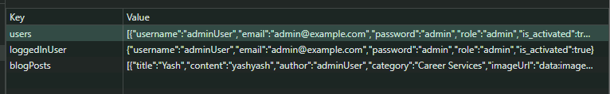

# UML Assignment 3

## Steps to run the project

- CD in project folder where `package.json` file is present and run command `npm install`.
- After Installing all required packages start the server using `npm start` command.

## Some Important instructions

- I have stored all the data in local storage.  

- To access local storage follow below steps:
    - Right click on your browser and click on `inspect`.
    - Go to `Application` tab.
    - In that tab you will see `Local Storage` under `Storage` section
    - Expand that and you will see `http://localhost:3000` click on it you will see all the data.
- You must keep local storage open in order to see wather the application is storing data correctly or not.
- User `Admin` and `Moderator` are hard coded.
- If the user create account from sugnup page will have default role of `student` and isActivated will be `True`

## Features Implemented
- Register user
    - Fields
        - username
        - email
        - password
        - confirm password
        - role (hidden, readonly)
            Role will be assigned as `student` by default
    - Validations
        - If the user with same username and email exist in the local database then it will not allow the user to create account
- Login
    - Fields
        - username
        - password
    - Restrictions
        - If user `IsActivated=Flase` then it will not allow the user to login
        - If user name or password does not match then also it will not allow to login
- CreatePost
    - Fields
        - Post Title
        - Post Content
        - Category
        - Upload Image
        - Author
- ReadPost
    - All user can read the post
    - If the user is logged in and is the same user who created that post will see the Deleet post button else can just read the post
- Comment
    - Only logged in user can comment to the posts
    - Only Author of that post can reply to that comment
- Manage Posts
    - If the user with moderator role is logged in they he or she will se the manage posts link on that dropdown.
    - Moderator can delete any post.
- Manage user
    - Admin can block any user to login back in the site. but cannot deleet the user.